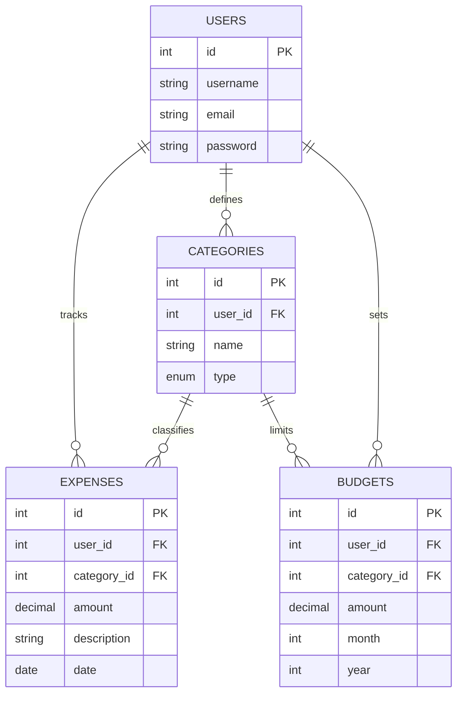

# Project Document: Cost Tracking App

## Tech Stack
-   **Frontend**: React.js (Vite), Tailwind CSS
-   **Backend**: Node.js, Express.js
-   **Database**: MySQL
-   **Authentication**: JSON Web Tokens (JWT)
-   **API Style**: RESTful

---

## ER Diagram


---

## Boilerplate Structure

### Backend Structure
```text
backend/
├── config/
│   └── db.js (Database connection)
├── controllers/ (Request logic)
│   ├── authController.js
│   ├── budgetController.js
│   ├── categoryController.js
│   ├── expenseController.js
│   └── reportController.js
├── middleware/
│   └── authMiddleware.js (JWT validation)
├── models/ (Database queries)
│   ├── User.js
│   ├── Budget.js
│   ├── Category.js
│   └── Expense.js
├── routes/ (API endpoints)
├── server.js (Entry point)
└── .env (Secrets)
```

### Frontend Structure
```text
frontend/
├── src/
│   ├── api/ (Axios configurations)
│   ├── components/ (Reusable UI components)
│   ├── context/ (Auth/Global state)
│   ├── pages/ (Login, Dashboard, Reports, etc.)
│   ├── App.jsx (Routing)
│   ├── index.css (Tailwind/Custom styles)
│   └── main.jsx
├── public/
└── index.html
```

---

## Execution Flow

### 1. User Registration & Login
1.  User submits credentials via Frontend.
2.  Backend validates credentials and generates a **JWT**.
3.  JWT is stored in `localStorage` or `Cookies` on the Frontend.

### 2. Expense Tracking
1.  User enters expense details.
2.  Backend verifies the user via JWT middleware.
3.  Expense data is saved to the MySQL `expenses` table.
4.  Frontend updates the dashboard state.

### 3. Financial Reports
1.  Backend aggregates expense data grouped by category/month.
2.  Frontend visualizes data using charts or tables.

---

## Wireframes

### Login Page
```text
+---------------------------------------+
|           Cost Tracking App           |
|                                       |
|      [ Email ]                        |
|      [ Password ]                     |
|                                       |
|      [ LOGIN BUTTON ]                 |
|      (Register Link)                  |
+---------------------------------------+
```

### Dashboard
```text
+---------------------------------------+
| Welcome, User!       [Logout]         |
+---------------------------------------+
| Totals: Income: $X | Expenses: $Y     |
+---------------------------------------+
| Recent Expenses   | Category Chart    |
| - Rent: $1000     | [Pie Chart Placeholder]|
| - Food: $50       |                   |
+---------------------------------------+
| [ ADD EXPENSE ] | [ VIEW REPORTS ]    |
+---------------------------------------+
```
